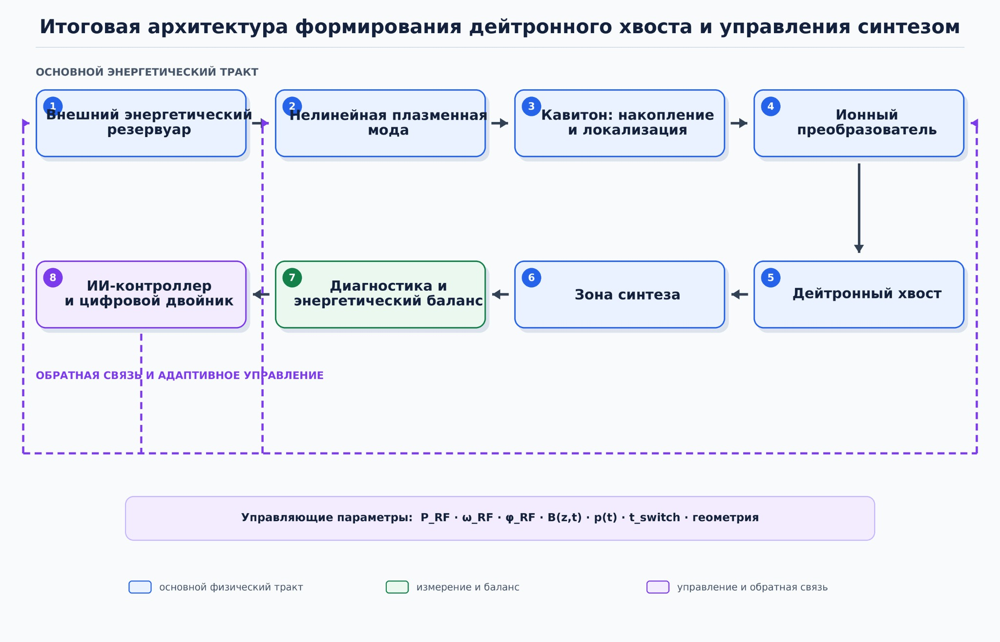

**ТЕХНИЧЕСКАЯ СПЕЦИФИКАЦИЯ**

**Алгоритм расчёта формирования дейтронного хвоста**

Версия 2.0: замкнутый энергетический контур, ионный преобразователь и
обратная связь от реакций синтеза

| **Параметр**     | **Значение**                                                                            |
|------------------|-----------------------------------------------------------------------------------------|
| Статус           | Концептуальный проект спецификации; программная реализация ещё не создана               |
| Авторский контур | Н. Н. Зобнин; развитие комплекса моделей редакции 10.08.2026                            |
| Дата             | 05.09.2026                                                                              |
| Назначение       | Формализация второго контура до начала программирования и регистрации новой редакции ПО |

| **Ключевое решение.** Версия 2.0 не заменяет и не переписывает исходную редакцию. Она создаётся как отдельная ветвь, в которой рассчитываются зарядка нелинейной моды, переключение энергии в ионный канал, формирование неравновесного хвоста, ядерный выход и возможная обратная энергетическая связь. Все неизвестные и квантово-космологические члены отключены по умолчанию. |
|-----------------------------------------------------------------------------------------------------------------------------------------------------------------------------------------------------------------------------------------------------------------------------------------------------------------------------------------------------------------------------------|

# 1. Восстановленный контекст второго контура

**Первый контур** проверял прямой открытый тракт: ВЧ-накачка → кавитон →
кинетическая передача → дейтроны. Он подтвердил локализацию поля, но не
подтвердил прямое получение дейтронов с энергией 1 кэВ.

**Второй контур** возник из идеи, что слабый запуск может играть роль
искры: не снабжать ионы всей энергией, а включать нелинейный процесс,
который затем поддерживается частью энергии продуктов синтеза. Поэтому
объектом расчёта становится замкнутая динамическая система, а не
одиночный коллапс.

*измеримый источник → нелинейная мода → кавитон → ионный преобразователь
→ f_D(E) → реакции D–D → перенос энергии продуктов → новая накачка*

| **Физическое ограничение.** Аналогия с искрой допустима только при наличии рассчитанного положительного коэффициента обратной связи. Энергия продуктов синтеза должна физически поглощаться плазмой, возбуждать нужную моду и создавать новое поколение ускоренных дейтронов. Сам факт реакции синтеза цепного механизма не создаёт. |
|--------------------------------------------------------------------------------------------------------------------------------------------------------------------------------------------------------------------------------------------------------------------------------------------------------------------------------------|

# 2. Отличия алгоритма 2.0 от исходного комплекса

| **Признак**         | **Редакция 1**                                  | **Версия 2.0**                                                                               |
|---------------------|-------------------------------------------------|----------------------------------------------------------------------------------------------|
| Топология           | Преимущественно прямой последовательный расчёт  | Замкнутый энергетический и управляющий контур                                                |
| Основная цель       | Получить и проверить кавитон и дейтронный хвост | Рассчитать условия появления, устойчивости и самоподдержания хвоста                          |
| Поле                | На отдельных уровнях предписанное               | В доказательном режиме — самосогласованное; в скрининге — редуцированное с явной маркировкой |
| Синтез              | Постобработка спектра                           | Динамический источник продуктов и обратной связи                                             |
| Оптимизация         | Поле, энергия отдельных частиц                  | Доля хвоста, время жизни, КПД передачи, петлевой коэффициент и энергобаланс                  |
| Управление          | Заданный сценарий                               | Замкнутая диагностика → цифровой двойник → управляющее воздействие                           |
| Спекулятивные члены | Не являются частью ядра                         | Изолированная песочница, выключенная по умолчанию                                            |

# 3. Назначение и проверяемые гипотезы

- H₀: после уменьшения или отключения внешней накачки дейтронный хвост
  > затухает; обратная связь от D–D недостаточна для поддержания режима.

- H₁: существует область классических параметров, в которой заряженные
  > продукты и индуцированные ими волны компенсируют часть потерь и
  > увеличивают время жизни хвоста.

- H₂: существует порог, выше которого петлевой энергетический
  > коэффициент достигает единицы и появляется устойчивое или
  > пульсирующее самоподдержание.

- H₃: при одинаковых энергии, спектре и классической форме сигнала его
  > корреляционная организация изменяет вероятность плазменного
  > перехода. Это отдельная высокорисковая гипотеза.

- H₄: после полного учёта известных входов и потерь остаётся
  > воспроизводимый энергетический остаток. До такого наблюдения
  > принимается H₄ = ложь и P_unknown = 0.

# 4. Область применимости

| **Входит в основное ядро**                       | **Не входит в основное ядро**                                   |
|--------------------------------------------------|-----------------------------------------------------------------|
| Классическая электродинамика и плазменные волны  | Передача энергии одной только запутанностью                     |
| Кинетика электронов и дейтронов                  | Недоступные секторы мультиверса как источник мощности           |
| Столкновения, зарядовый обмен и граничные потери | Сознание как физический управляющий параметр                    |
| D–D реакции, транспорт и торможение продуктов    | Отрицательное затухание без измеренного энергетического остатка |
| Классические коррелированные управляющие сигналы | Утверждение о самоподдержании без отключения внешнего источника |

# 5. Функциональная архитектура

*Рисунок 1 — Исходная архитектура второго контура. В алгоритме 2.0
выражение «внешний энергетический резервуар» означает только измеримый
ВЧ/DC-источник. Гипотетический неизвестный источник относится
исключительно к песочнице.*

| **Блок**                   | **Функция в расчёте**                                                               |
|----------------------------|-------------------------------------------------------------------------------------|
| 1\. Измеримый источник     | Временные ряды мощности, частоты, фазы, тока антенны и DC-смещений                  |
| 2\. Нелинейная мода        | Дисперсия, рост, затухание, фазовое состояние и плазменная нагрузка                 |
| 3\. Кавитон                | Накопление, локализация, порог и момент переключения                                |
| 4\. Ионный преобразователь | Двойной слой, нижнегибридная мода, ударный фронт, магнитное сопло или их комбинация |
| 5\. Дейтронный хвост       | Энергетическое и угловое распределение, доля хвоста и время жизни                   |
| 6\. Зона синтеза           | Скорость реакций по фактическому неравновесному распределению                       |
| 7\. Диагностика            | Спектр, поля, потоки, продукты реакции и замкнутый баланс энергии                   |
| 8\. Контроллер             | Прогноз состояния, выбор импульса и безопасное прекращение режима                   |

# 6. Минимальный вектор состояния и управления

*x(t) = {n_e, T_e, T_i, n_n, B, A, φ_A, L_cav, δn/n₀, f_e, f_D, W_E,
W_B, W_e, W_D, W_prod, W_wall}*

*u(t) = {P_RF, ω_RF, φ_RF, J_ant, B(z,t), p(t), ṁ(t), t_switch, U_DC,
geometry}*

Минимальное состояние обязательно сохраняет фазу. Передача только \|E\|
между уровнями недостаточна, потому что второй контур оптимизирует
момент переключения и фазовое согласование.

# 7. Математическое ядро

## 7.1. Зарядка и переключение нелинейной моды

*dA/dt = \[Γ_pump(u,x) + Γ_fb(x) − γ_coll − γ_wall − γ_ion − β\|A\|²\]A*

Режим разделяется на фазу зарядки, в которой растёт энергия электронной
или смешанной моды, и фазу разрядки, в которой управляющее воздействие
увеличивает связь с ионной компонентой.

*W_RF → W_e + W_A; W_A → W_DL / W_LH / W_shock → W_D*

## 7.2. Кинетика дейтронов

*∂f_D/∂t = −∂\[(G_res + G_DL + G_shock + G_fb − L_coll)f_D\]/∂E + ∂²(D_E
f_D)/∂E² + S_D − L_D*

Алгоритм рассчитывает всё распределение f_D(E, μ, z, t), а не только
температуру или максимальную энергию. Для редкого хвоста используются
взвешенные частицы, расщепление и независимая невзвешенная контрольная
серия.

## 7.3. Ядерный выход

*R_DD(t) = ½ ∫∫ f_D(v₁,t) f_D(v₂,t) σ_DD(v_rel) v_rel d³v₁ d³v₂ dV*

Две ветви D–D учитываются раздельно: T + p и ³He + n. Для каждого
продукта рассчитываются геометрия выхода, торможение, передача энергии
электронам и ионам, возбуждение волн и нагрузка на стенки.

## 7.4. Физическая обратная связь от продуктов синтеза

*P_fb,mode = Σ_b P_b · η_geom,b · η_stop,b · η_mode,b · η_phase,b*

Коэффициенты не задаются как свободная «эффективность синтеза». Они
вычисляются или ограничиваются сверху моделями траекторий, торможения и
волнового возбуждения. Нейтронная ветвь, как правило, в основном
покидает малую плазму и учитывается преимущественно как выход и
нагрузка, а не как полезная локальная обратная связь.

## 7.5. Энергетический регистр

*dW_sys/dt = P_RF + P_DC + P_aux + P_fb − P_boundary − P_wall − P_rad −
P_n − P_other*

*ε_W = \|ΔW_num\| / max(W_in, W_scale)*

- для ноутбучного скрининга: ε_W \< 3 %;

- для доказательного расчёта: ε_W \< 1 %;

- P_unknown = 0 в основном ядре.

## 7.6. Критерий самоподдержания

*K_loop = W_tail^(n+1) / W_tail^n после уменьшения внешней накачки*

*Λ = ∂P_gain/∂W_tail − ∂P_loss/∂W_tail*

| **Результат**                | **Интерпретация**                                                                 |
|------------------------------|-----------------------------------------------------------------------------------|
| K_loop \< 1 и Λ \< 0         | Хвост затухает; внешний источник остаётся обязательным                            |
| K_loop ≈ 1 и Λ ≤ 0           | Квазистационарный режим возможен только при поддерживающей мощности               |
| K_loop \> 1 и Λ \> 0         | Положительная обратная связь; требуется проверка насыщения и устойчивости         |
| Устойчивый цикл при P_RF → 0 | Кандидат на самоподдержание, но только после независимой проверки полного баланса |

# 8. Программная архитектура

| **Модуль**         | **Содержание**                                        | **Первичная платформа** |
|--------------------|-------------------------------------------------------|-------------------------|
| core_physics       | Константы, состав плазмы, сечения, единицы, дисперсия | Ноутбук                 |
| mode_dynamics      | Рост, затухание, фаза, зарядка и переключение         | Ноутбук                 |
| ion_converter      | DL/LH/ударная/магнитная ветви с единым интерфейсом    | Ноутбук → кластер       |
| tail_kinetics      | Fokker–Planck и/или MCC для f_D                       | Ноутбук                 |
| fusion_kernel      | D–D интеграл, ветви реакции и статистика событий      | Ноутбук                 |
| product_transport  | Траектории и торможение p, T, ³He, n                  | Ноутбук → кластер       |
| feedback_stability | K_loop, Λ, стационарные точки и бифуркации            | Ноутбук                 |
| energy_ledger      | Пошаговый баланс всех каналов                         | Все уровни              |
| digital_twin       | Оценка состояния и прогноз следующего импульса        | Ноутбук                 |
| hpc_validation     | Самосогласованный EM-PIC/Vlasov                       | Кластер                 |
| hypothesis_sandbox | Корреляционные и искусственные неизвестные члены      | Ноутбук; отключено      |

# 9. Последовательность вычисления

1.  Загрузить конфигурацию, версии сечений и геометрию; записать
    > контрольные суммы входов.

2.  Рассчитать фоновое состояние и проверить существование плазмы в
    > выбранном режиме.

3.  Получить дисперсию, затухание и допустимые нелинейные моды.

4.  Смоделировать зарядку кавитона и найти допустимые моменты
    > переключения.

5.  Для каждого посредника рассчитать передачу энергии в f_D(E, μ, z,
    > t).

6.  Вычислить D–D выход непосредственно по неравновесному распределению.

7.  Перенести продукты реакции и определить реально возвращаемую в
    > полезную моду мощность.

8.  Продолжить расчёт на несколько циклов после уменьшения P_RF и
    > получить K_loop и Λ.

9.  Повторить для независимых seed, сеток и контрольных режимов.

10. Сформировать отчёт: спектры, энергобаланс, неопределённость,
    > критерий продолжения или остановки ветви.

# 10. Ноутбучный и кластерный уровни

| **Уровень** | **Модель**                             | **Назначение**                                    | **Ресурс**         |
|-------------|----------------------------------------|---------------------------------------------------|--------------------|
| V2-L0       | 0D ODE + аналитические верхние границы | Быстро исключить энергетически невозможные режимы | Секунды–минуты     |
| V2-L1       | 1D по энергии Fokker–Planck/MCC        | Хвост, D–D выход, транспорт продуктов, K_loop     | Минуты–часы        |
| V2-L2       | 1D пространство + редуцированные моды  | Зарядка/переключение, геометрия обратной связи    | Часы–сутки         |
| V2-L3       | 1D3V semi-implicit EM-PIC              | Самосогласованная первая ступень                  | Кластер            |
| V2-L4       | 2D3V связанная система                 | Поперечные потери и окончательная верификация     | HPC/суперкомпьютер |

| **Практическое следствие.** В отличие от остановленного первого контура, разработку V2-L0 и V2-L1 можно начать на ноутбуке. Эти уровни не докажут существование самосогласованной волны, но количественно проверят саму идею «искры»: даже при предельно благоприятной передаче энергии хватает ли D–D выхода для K_loop ≥ 1. |
|-------------------------------------------------------------------------------------------------------------------------------------------------------------------------------------------------------------------------------------------------------------------------------------------------------------------------------|

# 11. Проверка корреляционных сигналов и гипотез

Песочница допускает сравнение сигналов, одинаковых по средней мощности,
амплитудному спектру, длительности и тепловой нагрузке, но различающихся
временной и фазовой корреляционной структурой.

| **Режим**                   | **Назначение**                                                      |
|-----------------------------|---------------------------------------------------------------------|
| Обычный детерминированный   | Базовая линия                                                       |
| Фазосогласованный           | Проверка классической когерентности                                 |
| Случайно перемешанные фазы  | Контроль роли фазовой структуры                                     |
| Классически коррелированный | Контроль информационной структуры при равной энергии                |
| Запутанный / сепарабельный  | Только будущий эксперимент с физически определённым интерфейсом     |
| Искусственный Γ_X           | Только анализ чувствительности; не считается физическим результатом |

*dW_A/dt = P_RF − 2γW_A − P_i(W_A) + 2Γ_XW_A, Γ_X = 0 по умолчанию*

# 12. Выходные показатели

- α_tail(t) — доля дейтронов выше заданных порогов 0,2; 1; 10; 30; 100
  > кэВ;

- E₅₀, E₉₀, E₉₉, E₉₉.₉ и доверительные интервалы, а не только E_max;

- τ_tail — время жизни полезной части распределения;

- η_A→D и η_fus→mode — эффективности прямой и обратной передачи;

- R_DD и отдельные скорости двух ветвей реакции;

- K_loop, Λ и положение стационарных точек;

- полный временной энергетический регистр и ε_W;

- чувствительность к сечениям, геометрии, seed и управляющим параметрам.

# 13. Ворота и критерии прекращения

| **Ворота** | **Критерий продолжения**                                           | **Если не выполнен**                                                   |
|------------|--------------------------------------------------------------------|------------------------------------------------------------------------|
| A          | Верхняя граница энергии обратной связи не исключает K_loop ≥ 1     | Закрыть гипотезу самоподдержания, сохранить задачу управляемого хвоста |
| B          | V2-L1 даёт воспроизводимый хвост и непренебрежимый D–D выход       | Не переходить к пространственной модели                                |
| C          | V2-L2 показывает физический канал возврата энергии                 | Не запрашивать HPC для замкнутого контура                              |
| D          | EM-PIC подтверждает ионный посредник и баланс \< 1 %               | Опубликовать отрицательный результат                                   |
| E          | После снижения P_RF получено K_loop ≥ 1 с доверительным интервалом | Не использовать термин «самоподдерживающийся»                          |
| F          | Независимая диагностика связывает f_D с ядерным выходом            | Не переходить к экспериментальному масштабированию                     |

# 14. Верификация и тесты

- нулевая накачка не создаёт энергию или хвост;

- при σ_DD = 0 исчезают продукты и обратная связь;

- при η_mode = 0 ядерный выход не влияет на следующий цикл;

- результат сходится при уменьшении шага и увеличении числа частиц;

- взвешенная и невзвешенная серии согласуются в пределах
  > неопределённости;

- сумма всех каналов энергии воспроизводит внешний ввод и изменение
  > запасённой энергии;

- искусственный Γ_X никогда не попадает в отчёт основного физического
  > режима;

- каждый график содержит статус: screening, prescribed field,
  > self-consistent или hypothesis sandbox.

# 15. Предлагаемая структура файлов

<table>
<colgroup>
<col style="width: 100%" />
</colgroup>
<thead>
<tr class="header">
<th>algorithm_v2/ 
configs/ # версии параметров и геометрии 
core_physics/ # константы, сечения, дисперсия 
mode_dynamics/ # зарядка и переключение 
ion_converter/ # DL, LH, shock, nozzle 
tail_kinetics/ # f_D и редкий хвост 
fusion_kernel/ # D–D реакции 
product_transport/ # перенос продуктов 
feedback_stability/ # K_loop и бифуркации 
energy_ledger/ # баланс 
digital_twin/ # оценка состояния и управление 
hypothesis_sandbox/ # выключено по умолчанию 
validation/ # сравнение уровней 
tests/ # автоматические тесты 
reports/ # воспроизводимые отчёты</th>
</tr>
</thead>
<tbody>
</tbody>
</table>

# 16. План первой программной реализации

| **Этап**    | **Результат**                                                                     | **Вычислительная среда** |
|-------------|-----------------------------------------------------------------------------------|--------------------------|
| 2.0-alpha-1 | Энергетический регистр, D–D kernel и аналитическая верхняя граница обратной связи | Ноутбук                  |
| 2.0-alpha-2 | Редуцированная кинетика хвоста и транспорт заряженных продуктов                   | Ноутбук                  |
| 2.0-alpha-3 | Многопериодная петля, K_loop, устойчивость и UQ                                   | Ноутбук                  |
| 2.0-beta    | Связь с существующими уровнями 1–4.8 и единый формат состояния                    | Ноутбук                  |
| 2.0-rc      | Адаптер к semi-implicit EM-PIC и кластерные контрольные серии                     | Кластер                  |

# 17. Решение о начале работ

Начинать следует с V2-L0, а не с переписывания PIC-комплекса. Первая
вычислимая задача — получить строгую верхнюю границу петлевого
коэффициента для D–D при заданных n_D, f_D(E), объёме, времени удержания
и максимально благоприятной доле возврата энергии.

*если даже K_loop,max ≪ 1, гипотеза «искры» закрывается без
дорогостоящего PIC; если K_loop,max ≳ 1, уточняются транспорт и волновая
связь*

| **Итог.** Вторая версия алгоритма является самостоятельной формализацией гипотезы положительной обратной связи. Она позволяет продолжить работу на ноутбуке, не выдавая концептуальные предположения за установленную физику и не смешивая их с зафиксированной редакцией первого программного комплекса. |
|-----------------------------------------------------------------------------------------------------------------------------------------------------------------------------------------------------------------------------------------------------------------------------------------------------------|

# Приложение А. Минимальный паспорт расчёта

| **Группа**      | **Обязательные поля**                                      |
|-----------------|------------------------------------------------------------|
| Идентификация   | run_id, версия кода, SHA-256 конфигурации, дата, seed      |
| Плазма          | состав, n_e, n_D, n_n, T_e, T_i, давление, геометрия       |
| Управление      | P_RF(t), ω(t), φ(t), J_ant(t), B(z,t), t_switch            |
| Численный метод | решатель, сетка, шаг, частицы, допуски, граничные условия  |
| Данные          | наборы сечений, версии, диапазон, интерполяция             |
| Результат       | f_D, α_tail, R_DD, P_fb, K_loop, Λ, ε_W                    |
| Статус          | screening / prescribed field / self-consistent / sandbox   |
| Решение         | продолжить / уточнить / остановить с формальным основанием |
