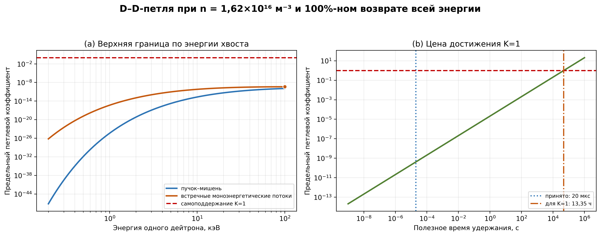

**РЕШЕНИЕ БЛИЖАЙШИХ ВОРОТ ПРОЕКТА**

Есть ли у второго контура физический запас?

Аналитический отчёт по строгой верхней границе D–D-обратной связи ·
2.0-alpha-1

<table>
<colgroup>
<col style="width: 2%" />
<col style="width: 97%" />
</colgroup>
<thead>
<tr class="header">
<th></th>
<th>
<strong>Итог: самоподдерживающаяся D–D-петля исключается в
текущем режиме</strong>

Строгая оптимистическая граница K_loop,max = 4.162e-10. До единицы не
хватает множителя 2.40e+09 — около 2,4 млрд. Любая реальная
эффективность возврата только уменьшит коэффициент.
</th>
</tr>
</thead>
<tbody>
</tbody>
</table>

| **Рассматриваемый контур** | D-хвост → D–D-реакции → энергия продуктов → новый D-хвост                             |
|----------------------------|---------------------------------------------------------------------------------------|
| **Версия алгоритма**       | 2.0-alpha-1                                                                           |
| **Расчётная задача**       | Верхняя граница петлевого энергетического коэффициента                                |
| **Результат ворот**        | NO-GO для самоподдержания при текущих n и τ; внешне накачиваемая ветвь не отвергается |
| **Платформа**              | Ноутбучный расчёт; 6/6 тестов успешно                                                 |
| **Дата**                   | 05.09.2026                                                                            |

# 1. Проверяемая гипотеза

Проверяется идея «искры»: небольшой внешний импульс создаёт начальный
дейтронный хвост, после чего энергия продуктов D–D-реакций формирует
хвост следующего поколения. Необходимое условие самоподдержания —
возвратить за один полезный цикл не меньше энергии, чем содержалось в
исходном хвосте.

*K_loop = W_return / W_tail ; самоподдержание возможно только при K_loop
≥ 1.*

Вычисляется не прогноз реального устройства, а верхняя граница. Поэтому
отрицательный результат имеет большую логическую силу: если K_loop,max
\< 1 в заведомо идеализированной системе, добавление физических потерь
не может изменить знак вывода.

# 2. Почему граница действительно завышена

- Все дейтроны расчётного объёма отнесены к моноэнергетическому хвосту;
  разбавление хвоста не используется как способ улучшить результат.

- Для предельной ветви всем парам назначена встречная геометрия: E_cm =
  2E_D, то есть максимально благоприятная относительная энергия двух
  равных пучков.

- На протяжении τ = 20 мкс плотность и энергия хвоста не истощаются.

- Удерживается и с единичной эффективностью возвращается вся ядерная
  энергия обеих D–D-ветвей, включая энергию нейтронов 2,45 МэВ.

- Отсутствуют потери на электроны, стенки, излучение, зарядовый обмен,
  расходимость, неполное поглощение и обратное преобразование.

- Вероятности реакций вычислены по параметризации Bosch–Hale; максимум
  найден полным логарифмическим сканированием 0,2–100 кэВ по энергии
  одного дейтрона.

<table>
<colgroup>
<col style="width: 2%" />
<col style="width: 97%" />
</colgroup>
<thead>
<tr class="header">
<th></th>
<th>
<strong>Следствие</strong>

Обозначим реальную суммарную эффективность возврата η_return ≤ 1.
Тогда K_loop,real ≤ η_return · K_loop,max ≤ K_loop,max. Расчёт не
оставляет скрытого коэффициента эффективности, способного поднять
результат выше верхней границы.
</th>
</tr>
</thead>
<tbody>
</tbody>
</table>

# 3. Математическая модель

Для ветви j использованы сечение σ_j(E_cm), относительная скорость v_rel
и энергия продуктов Q_j. Для одинаковых встречных потоков:

*R/V = ½ n_D² v_rel Σ_j σ_j ; W_tail = n_D V E_D.*

*W_return,max = τ · ½ n_D² V v_rel Σ_j\[σ_j Q_j\].*

*K_loop,max = n_D τ · v_rel Σ_j\[σ_j Q_j\] / (2E_D).*

Объём V сокращается из коэффициента K_loop: увеличение объёма
одновременно увеличивает число реакций и запас энергии хвоста.
Критическая величина для этой упрощённой проверки — произведение n_Dτ, а
не мощность источника сама по себе.

| **D–D-ветвь** | **Полная Q, МэВ** | **Заряженная часть, МэВ** | **Что возвращается в абсолютной границе** |
|---------------|-------------------|---------------------------|-------------------------------------------|
| D(d,n)³He     | 3,268             | 0,820                     | 3,268 МэВ, включая нейтрон                |
| D(d,p)T       | 4,033             | 4,033                     | 4,033 МэВ                                 |

# 4. Входные параметры

| **Параметр**             | **Значение**      | **Роль**                                              |
|--------------------------|-------------------|-------------------------------------------------------|
| Плотность дейтронов n_D  | 1,62×10¹⁶ м⁻³     | Ранее найденный рабочий плазменный режим              |
| Полезное время τ         | 20 мкс            | Оптимистическое время существования/обновления хвоста |
| Радиус и длина           | 3,259 мм; 2,998 м | V = 1,00052×10⁻⁴ м³                                   |
| Энергия хвоста           | 0,2–100 кэВ       | Полный диапазон поставленной задачи                   |
| Возврат продуктов        | η = 1             | Предельное допущение                                  |
| Число точек сканирования | 2001 на геометрию | Логарифмическая сетка                                 |

Параметризация Bosch–Hale имеет заявленный рабочий диапазон,
начинающийся примерно от E_cm = 0,5 кэВ. Низкоэнергетическая часть скана
ниже этой границы является экстраполяцией, но она не влияет на вывод:
найденный максимум расположен при E_cm = 200 кэВ, внутри рабочего
диапазона формулы.

# 5. Главный расчёт

| **Величина**                | **Предельное значение**      |
|-----------------------------|------------------------------|
| Геометрия максимума         | Два встречных равных потока  |
| Энергия одного дейтрона E_D | 100 кэВ                      |
| Энергия центра масс E_cm    | 200 кэВ                      |
| Суммарное D–D-сечение       | 1.147304e-29 м² = 114,73 мб  |
| σv                          | 7.103504e-23 м³/с            |
| Расчётное число реакций     | 9.326074e+05 с⁻¹             |
| Полная D–D-мощность         | 5.404509e-07 Вт = 0,540 мкВт |
| Энергия всего хвоста        | 2.596878e-02 Дж              |
| Возврат за 20 мкс           | 1.080902e-11 Дж              |
| K_loop,max                  | 4.162312e-10                 |
| Дефицит до K=1              | 2.402511e+09                 |

*Рисунок 1 — Верхняя граница петлевого коэффициента и требуемое время
удержания*

# 6. Зависимость от энергии

| **E_D, кэВ** | **K_max: пучок–мишень** | **K_max: встречные потоки** |
|--------------|-------------------------|-----------------------------|
| 1            | 4.183e-25               | 4.617e-16                   |
| 3            | 1.143e-17               | 1.076e-12                   |
| 10           | 2.072e-13               | 6.205e-11                   |
| 30           | 1.577e-11               | 2.721e-10                   |
| 100          | 1.170e-10               | 4.162e-10                   |

На ближайшем рубеже 1 кэВ даже искусственно идеальная встречная схема
даёт K_loop,max = 4,62×10⁻¹⁶. Рост до 100 кэВ повышает реактивность, но
недостаточен: верхняя граница остаётся на 9,38 порядка ниже единицы.

# 7. Какой параметр пришлось бы изменить

| **Условие**                | **Требуется для K=1** | **Сопоставление с принятым режимом** |
|----------------------------|-----------------------|--------------------------------------|
| Произведение n_Dτ          | 7.784e+20 м⁻³·с       | в 2.40e+09 раза больше               |
| τ при n_D = 1,62×10¹⁶ м⁻³  | 48050.2 с = 13,35 ч   | вместо 20 мкс                        |
| n_D при τ = 20 мкс         | 3.892e+25 м⁻³         | вместо 1,62×10¹⁶ м⁻³                 |
| Только заряженные продукты | K = 2.630e-10         | ещё ниже; даже без прочих потерь     |

Требуемое время 13,35 часа не является проектным предложением: оно
получено при неизменной моноэнергетической популяции 100 кэВ и без
истощения. В реальной низкотемпературной плазме замедление и уход частиц
наступают намного раньше. Требуемая плотность 3,89×10²⁵ м⁻³ также
выводит задачу далеко за пределы исходного режима.

# 8. Энергетический регистр

| **Статья за цикл 20 мкс** | **Энергия, Дж** | **Комментарий**                         |
|---------------------------|-----------------|-----------------------------------------|
| Исходный хвост            | 2.596878359e-02 | Знаменатель K_loop                      |
| Ядерное выделение         | 1.080901763e-11 | Обе D–D-ветви                           |
| Полезный возврат          | 1.080901763e-11 | Равен выделению только из-за η=1        |
| Невозвращённая энергия    | 0.0e+00         | Принудительно ноль в абсолютной границе |
| Численный остаток         | 0.0e+00         | Баланс закрыт                           |

Регистр отделяет ядерное выделение от полезного возврата. В следующих
версиях в него можно без изменения определения K_loop добавить
электронный нагрев, стеночные потери, нейтронную утечку, эффективность
преобразователя и внешнюю ВЧ/DC-мощность.

# 9. Решение по второму контуру

<table>
<colgroup>
<col style="width: 2%" />
<col style="width: 97%" />
</colgroup>
<thead>
<tr class="header">
<th></th>
<th>
<strong>Ветка «искра → самоподдерживающаяся D–D-цепь»: закрыть на
текущих параметрах</strong>

Запас отсутствует не на несколько процентов, а более чем на девять
порядков даже в абсолютной верхней границе. Детализация кавитонов,
посредников передачи энергии или ИИ-управления не может компенсировать
этот энергетический дефицит: их эффективности не превышают
единицы.
</th>
</tr>
</thead>
<tbody>
</tbody>
</table>

Это решение не означает остановку всей версии 2.0. Различаются три
утверждения:

- Самоподдержание хвоста энергией D–D-продуктов в текущем
  низкоплотностном микросекундном режиме — физического запаса нет.

- Внешне питаемое многоступенчатое формирование хвоста — данным расчётом
  не опровергнуто, но требует отдельного энергобаланса и кластерной
  EM-PIC-проверки.

- Энергия продуктов D–D может быть измеримым диагностическим сигналом
  или малой поправкой к управлению, но не основным источником следующего
  поколения хвоста.

# 10. Рекомендуемое продолжение

1.  Зафиксировать 2.0-alpha-1 как отрицательные энергетические ворота и
    не расходовать ресурсы на самоподдерживающуюся D–D-ветвь при
    исходных n и τ.

2.  Сохранить энергетический регистр как обязательный базовый модуль
    версии 2.0.

3.  Следующий ноутбучный модуль направить на внешне питаемый каскад: по
    каждой ступени учитывать ВЧ/DC-вход, полезную ионную мощность,
    потери и долю переноса между энергетическими интервалами.

4.  Возвращаться к петлевой гипотезе только при появлении измеримого
    режима, который увеличивает n_Dτ на многие порядки, либо при замене
    топливного цикла; оба случая требуют отдельной постановки.

# 11. Верификация и ограничения

| **Проверка**              | **Результат**                                                              |
|---------------------------|----------------------------------------------------------------------------|
| Автоматические тесты      | 6/6 успешно                                                                |
| Контрольная точка сечения | σ_DD(10 кэВ) = 0,5591 мб; σ_DD(100 кэВ) = 70,049 мб                        |
| Закрытие регистра         | Численный остаток 0 Дж в предельном режиме                                 |
| Обратная проверка порога  | Подстановка рассчитанного (nτ)\_req возвращает K=1                         |
| Ограничение модели        | Не EM-PIC/Vlasov; не моделирует формирование хвоста и замедление продуктов |

# 12. Источники данных

1\. H.-S. Bosch, G. M. Hale. Improved formulas for fusion cross-sections
and thermal reactivities. Nuclear Fusion 32 (1992) 611.
[<u>https://doi.org/10.1088/0029-5515/32/4/I07</u>](https://doi.org/10.1088/0029-5515/32/4/I07)

2\. NIST. CODATA 2022 recommended values: elementary charge and SI
constants.
[<u>https://physics.nist.gov/cuu/pdf/wallet_2022.pdf</u>](https://physics.nist.gov/cuu/pdf/wallet_2022.pdf)

3\. NNDC QCalc. Q-value calculator based on AME2020 masses.
[<u>https://www.nndc.bnl.gov/qcalc/</u>](https://www.nndc.bnl.gov/qcalc/)

Примечание: значения Q в версии alpha-1 зафиксированы непосредственно в
коде; перед публикационной редакцией рекомендуется дополнительно сверить
их по выбранной версии таблицы атомных масс и записать номер версии в
метаданные.

# Заключение

**Физического запаса для самоподдерживающейся D–D-петли второй контур в
текущем режиме не имеет.** Полученная верхняя граница настолько мала,
что дальнейшая детализация именно этой ветви нерациональна. Полезное
развитие версии 2.0 следует перенести на строго внешне питаемую
архитектуру и использовать созданный регистр как критерий закрытия
энергии на каждой ступени.
